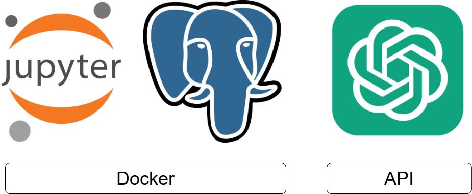
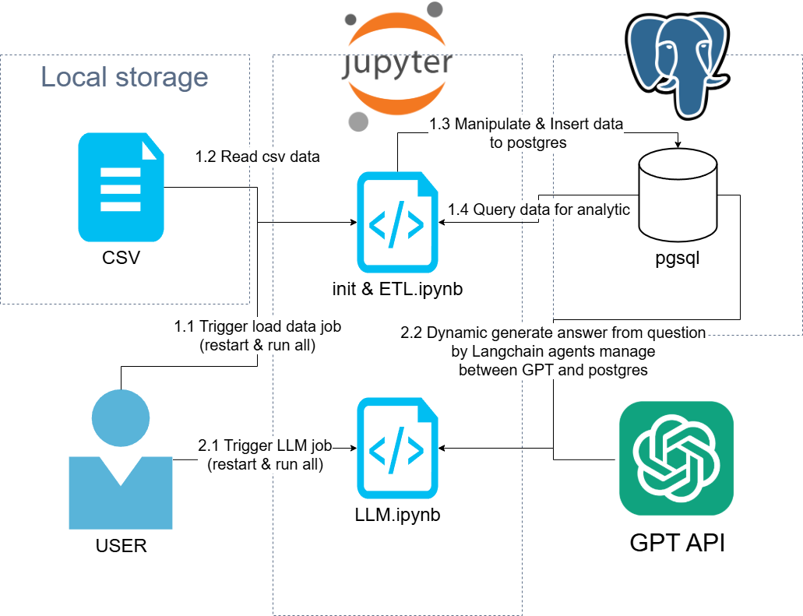
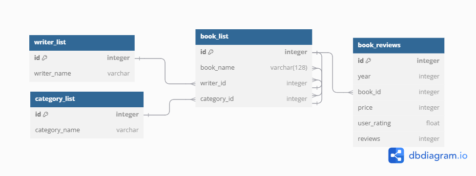
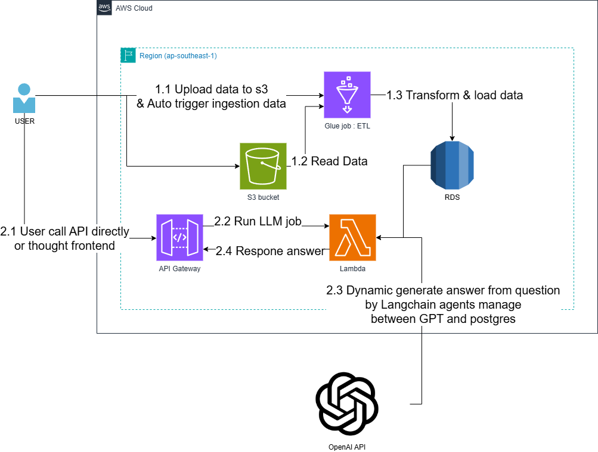

# hw-sourcecode-parames
## Overview for demo
### Architechture



Internal components run on docker (docker-compose). components consist of
- Jupyter notebook for python code running data pipline
- Postgres for sql database

External component consist of
- OpenAI provide LLM resource

### Data pipeline



Jobs consist of
1. Init database schema & ETL from csv to Postgres
2. LLM QnA on Postgres data

## Project setup & testing
### Dependency
consist of
1. Docker
2. Makefile (if you don't need install. please find detail of command in Makefile)
3. OpenAI API Key ([How to get key ?](https://www.youtube.com/watch?v=OB99E7Y1cMA))

### Setup
1. Copy `example.env` to `.env`
2. Add your OpenAI API Key to `.env`
3. Start project
```
make local-start 
```

### Testing
1. Go to 
2. ETL testing by restart & run all `init & ETL.ipynb`. after job done, you can explore data on postgres by get config from `.env` and connect to `localhost`
3. Dynamic generate answer testing by restart & run all `LLM.ipynb`. after job done, you can explore on your Jupyter notebook console

### Stop project
```
make local-stop 
```

## Additional
### Answer your homework
1. Find explanation on first section of git. Find raw diagram on diagram folder.
2. Find explanation on [init & ETL.ipynb](http://localhost:8889/lab/tree/work/init%20%26%20ETL.ipynb)
3. Find explanation on [LLM.ipynb](http://localhost:8889/lab/tree/work/LLM.ipynb)

### Database design 



### Production Architechture
#### Serverless base


